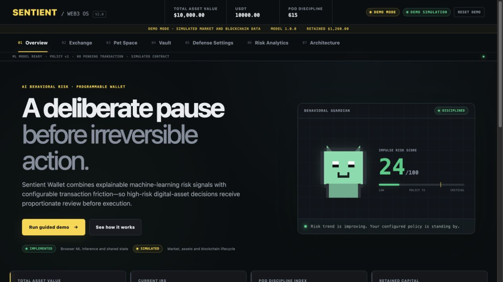
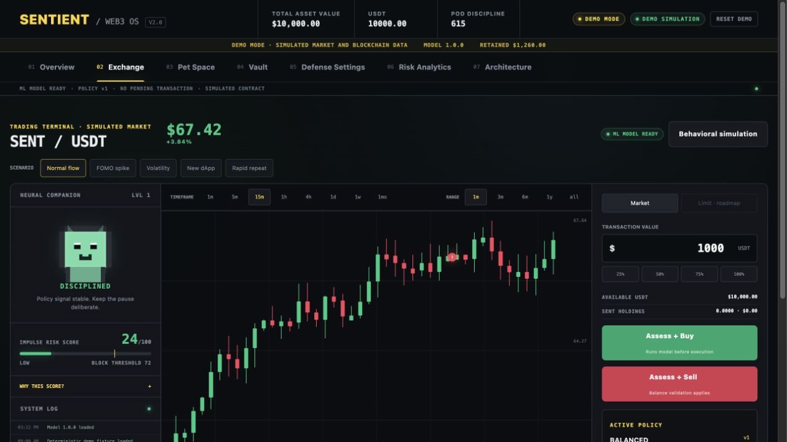
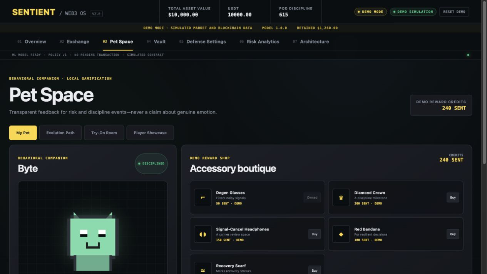
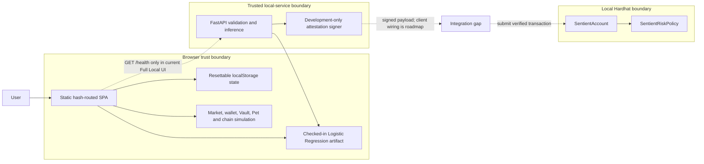

# Sentient Wallet

**AI Behavioral Risk & Programmable Wallet Prototype**

> An explainable ML risk engine combined with programmable smart-account controls to test whether proportionate transaction friction can reduce simulated behavioral risk in digital-asset environments.

Sentient Wallet is an independent, local-first portfolio project. It turns a behavioral-wallet concept into a reviewable system: a deterministic browser demo, a reproducible synthetic-data ML pipeline, a typed FastAPI inference service, and Solidity policy contracts for a local Hardhat chain.



## Competition origin

> Sentient Wallet originated as a Web3 ideation project and achieved 4th place in the HKUST Web3 Ideation Competition. The original HTML prototype explored impulse-risk scoring, programmable friction, discipline surplus and a behavioral companion. This repository rebuilds those ideas as an independently engineered ML and blockchain prototype.

That statement describes the project's origin; it does not imply endorsement, sponsorship, or institutional affiliation.

## What this project demonstrates

- A seven-view, hash-routed web experience covering Overview, Exchange, Pet Space, Vault, Defense Settings, Risk Analytics, and Architecture.
- Deterministic in-browser Logistic Regression using checked-in preprocessing statistics, coefficients, metadata, metrics, and parity vectors—not a random score generator.
- Inspectable risk drivers and configurable friction: allow, ask for confirmation, or queue a cooldown according to separate model and policy thresholds.
- A reproducible ML workflow that generates 6,000 seeded synthetic rows, evaluates two candidates, and exports a browser-readable artifact.
- A typed FastAPI service that validates features, reproduces inference, and can sign short-lived development-only EIP-712 attestations.
- Local Solidity prototypes that verify attestations, prevent replay, enforce versioned thresholds and cooldowns, and support queue/cancel/execute account flows.
- Explicit trust boundaries, accounting invariants, limitations, and false-positive/false-negative trade-offs.

## Implementation truth

| Area | Status | What that means today |
|---|---|---|
| Browser product experience | **Implemented prototype** | The static SPA, shared `localStorage` state, browser model inference, policy interactions, analytics, and all seven views run locally. |
| ML pipeline and artifacts | **Implemented prototype** | Seeded synthetic-data generation, training, candidate comparison, evaluation, export, checksum metadata, and browser/Python parity tests are present. |
| FastAPI risk service | **Implemented local component** | Typed assessment and optional development-attestation endpoints run and are covered by backend tests. |
| Solidity policy and account | **Implemented local component** | The Hardhat contracts compile and have tests for signature, policy, nonce, replay, cooldown, cancellation, and execution behavior. They are unaudited and local-only. |
| Full Local browser integration | **Partial integration** | `?mode=full` health-checks the API and changes the UI mode indicator. The transaction flow does **not yet** call the API or submit its attestation to the deployed contracts; it still uses browser inference and the simulated lifecycle. |
| Market, balances, trades, Vault, rewards, Pet, and browser chain events | **Simulation** | No live price feed, wallet, token, protocol, yield, credit, or real asset is connected. Values persist only as local demo state. |
| ERC-4337 production deployment, bundler/paymaster, live protocols, and Proof-of-Discipline lending | **Roadmap** | These require security review, privacy/fairness validation, product research, legal analysis, and production infrastructure. |

## Product flow

1. Load a deterministic market fixture or change the simulated transaction amount.
2. Transform observable transaction/context proxies into a probability and 0–100 Impulse Risk Score (IRS).
3. Inspect signed feature contributions and the active policy separately from the model result.
4. Allow a low-risk demo transaction, request confirmation, or queue a mandatory cooldown.
5. Cancel or execute the queued action, then trace the result through the audit ledger, companion state, Vault accounting, and analytics.

The Vault's “retained capital” is an accounting simulation: it is the value of cancelled demo transactions. Illustrative allocation, yield, and counterfactual loss figures never move assets and are not forecasts.

## Screens

| Risk-aware Exchange | Behavioral companion |
|---|---|
|  |  |

Additional captures: [Vault](screenshots/integrated/vault.png), [Defense Settings](screenshots/integrated/settings.png), [Risk Analytics](screenshots/integrated/analytics.png), and [Architecture](screenshots/integrated/architecture.png). The preserved [legacy screenshots](screenshots/legacy/) document the source prototype rather than the rebuilt interface.

## Architecture



The off-chain service and development signer are trusted components. Browser state is visible and mutable, while the local contract prototype demonstrates enforcement of exact attestation fields, signer authority, nonce, expiry, policy version, thresholds, and cooldown state. It is ERC-4337-inspired—not production-compatible account abstraction.

See [architecture.md](docs/architecture.md) and [blockchain-design.md](docs/blockchain-design.md) for the detailed trust model and accounting/enforcement boundaries.

## ML methodology and actual results

The published model is **Sentient IRS Logistic Regression v1.0.0**. The pipeline uses seed `20260819`, 6,000 synthetic rows, and a fixed stratified 75/25 split: 4,500 training rows and 1,500 held-out rows. Logistic Regression and Random Forest use the same split. The selected model won a published weighted score combining discrimination, recall, precision, F1, calibration, and interpretability; accuracy is intentionally excluded.

Held-out Logistic Regression results at the 0.50 classification threshold:

| Metric | Value |
|---|---:|
| Selection score | 0.7381 |
| ROC-AUC | 0.7809 |
| Precision | 0.6770 |
| Recall | 0.5307 |
| F1 | 0.5950 |
| False-positive rate | 0.1412 |
| False-negative rate | 0.4693 |
| Brier score | 0.1756 |
| Expected calibration error | 0.0188 |
| Confusion matrix `[[TN, FP], [FN, TP]]` | `[[827, 136], [252, 285]]` |

These metrics measure recovery of designer-authored **synthetic labels**. They do not measure real loss prevention, regret, intent, emotion, impairment, creditworthiness, or financial outcomes. The 46.93% false-negative rate is material: lowering a policy threshold can catch more synthetic elevated-risk cases, but it will also interrupt more benign actions.

Full methodology, threshold analysis, feature definitions, and candidate results are in the [model card](docs/model-card.md) and [risk methodology](docs/risk-methodology.md). Machine-readable evidence lives in [`assets/models/`](assets/models/).

## Quick start: Browser Demo

The simplest review path requires only Python and a local HTTP server:

```bash
python3 -m http.server 8080
```

Open <http://localhost:8080/#overview>. No wallet, API key, backend, contract deployment, or package install is required. Use HTTP rather than opening `index.html` directly so the browser can load the model artifacts.

Docker is optional:

```bash
make demo
```

For Vinext/React development:

```bash
npm ci
npm run dev
```

Open the local URL printed by the development server.

## Full Local stack

Prerequisites: Docker with Compose and `make`.

```bash
cp .env.example .env   # optional; built-in local defaults already work
make full
```

Then open <http://localhost:8080/?mode=full#overview>.

| Service | Local endpoint | Purpose |
|---|---|---|
| Static frontend | <http://localhost:8080> | Browser demo and Full Local health detection |
| FastAPI | <http://localhost:8000/docs> | Validated model inference and optional development attestations |
| Hardhat JSON-RPC | `http://localhost:8545` | Local chain for policy/account contracts |
| Contract deployer | One-shot Compose service | Deploys deterministic local policy/account instances after Hardhat is healthy |

Stop the stack with:

```bash
make stop
```

The development signer is derived at runtime from a public label and accepts attestations only for local chain ID `31337`; no private key is committed. It is still deterministic and public, so never reuse or fund it on another network. An optional override may be placed only in the ignored `.env`. Full Local currently proves that the API, signer, contracts, and orchestration can run locally; the UI-to-API-to-contract transaction path remains an explicitly documented integration task.

## Reproduce the ML artifacts

From the repository root:

```bash
python3 -m venv .venv
source .venv/bin/activate
python -m pip install -r ml/requirements.txt
python -m ml.run_pipeline
python -m pytest ml/tests -q
```

Generated CSV and Python training bundles remain ignored under `ml/data/` and `ml/artifacts/`. Reviewable browser artifacts are exported to `assets/models/`.

## Verification

The GitHub Actions workflow runs these independent suites without cloud credentials:

```bash
# Web build, lint and static rendering tests
npm ci
npm run lint
npm test

# Backend
python -m pip install -r backend/requirements.txt
(cd backend && python -m pytest)

# ML
python -m pip install -r ml/requirements.txt
python -m pytest ml/tests -q

# Solidity
(cd contracts && npm ci && npm run compile && npm test)
```

Python lint and type checks are also enforced in CI. The backend and ML jobs use separate environments because their reproducibility files pin independent dependency versions.

## Repository map

```text
app/                    Vinext/React host shell
assets/css/             Product interface styles
assets/js/              Hash router, state, model client, simulation and views
assets/models/          Checked-in model, metadata, metrics and parity vectors
backend/                FastAPI inference and development-attestation service
contracts/              Hardhat policy/account contracts, deployment and tests
docs/                   Architecture, model, risk, blockchain and AI governance
infrastructure/         Static frontend container configuration
legacy/                 Preserved source prototype
ml/                     Synthetic-data, training, evaluation and export pipeline
screenshots/             Integrated and legacy visual evidence
tests/                   Web build/static-render tests
```

The static Browser Demo can be served from the repository root, including through GitHub Pages with branch-root publishing. Hash navigation keeps routes compatible with static hosting. The Full Local services cannot run on GitHub Pages.

## Responsible AI and disclaimer

Sentient Wallet is an experimental educational prototype—not a financial product, psychological assessment, security guarantee, wallet for real funds, or source of investment, legal, medical, or credit advice. The IRS uses contextual proxies and must not be described as detecting emotion, addiction, impairment, intent, or character. Users need visible reasons, proportionate controls, a correction path, and the ability to reset local data.

No production deployment should proceed without real-world validation, calibrated thresholds, subgroup/fairness analysis, privacy and retention controls, adversarial testing, accessibility/user research, independent smart-contract review, and a clear incident and recovery model. See [responsible-ai.md](docs/responsible-ai.md) and [limitations.md](docs/limitations.md).

This project is independently engineered and has no affiliation with financial institutions, blockchain protocols, wallet vendors, cloud providers, or technology vendors named in code or documentation.

## Documentation

- [System architecture](docs/architecture.md)
- [Business case](docs/business-case.md)
- [Blockchain design](docs/blockchain-design.md)
- [Model card](docs/model-card.md)
- [Risk methodology](docs/risk-methodology.md)
- [Responsible AI](docs/responsible-ai.md)
- [Known limitations](docs/limitations.md)
- [Legacy feature inventory](docs/legacy-feature-inventory.md)
- [Migration plan](docs/migration-plan.md)

## License

Released under the [MIT License](LICENSE).
