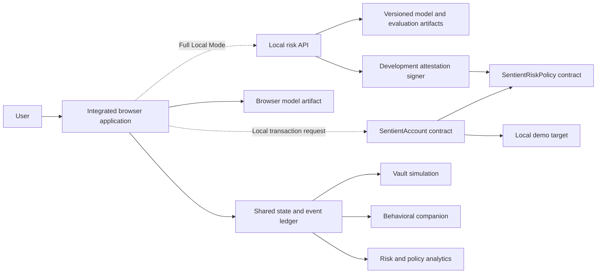

# Sentient Wallet Architecture

## Document purpose and status

This document describes the intended architecture of **Sentient Wallet**, an independent educational prototype for explainable transaction-risk assessment and programmable wallet friction. It is based on the preserved legacy interface, the product pitch materials, and the engineering rebuild brief.

It is an architecture description, not a certification that every component is complete, deployed, secure, or production-ready. A source file being present means only that a prototype implementation exists for review; runtime behavior must still be established by generated artifacts, tests, and end-to-end validation.

### Status vocabulary

| Status | Meaning in this repository |
|---|---|
| **Prototype source** | Executable or reviewable implementation source exists locally, but production readiness and full integration are not claimed. |
| **Simulation** | A deterministic or user-driven demonstration that moves no real assets and must be labelled in the interface. |
| **Roadmap** | A proposed capability that must not be represented as implemented. |

## Architectural goals

The rebuild is designed to:

1. preserve the recognizable trading-terminal interface and material legacy interactions;
2. integrate all user-facing views behind one application shell and one shared state;
3. replace random or hand-tuned primary risk scoring with reproducible model inference;
4. make the score explainable in terms of observable transaction and market-context features;
5. translate risk output and user policy into proportionate confirmation or cooldown behavior;
6. demonstrate local smart-contract enforcement without requiring real funds, cloud accounts, or production keys;
7. keep simulated market, Vault, companion, and blockchain behavior visibly separate from implemented local components; and
8. make trust assumptions, privacy boundaries, accounting rules, and limitations inspectable.

The architecture does **not** claim to detect emotion, diagnose behavior, guarantee loss prevention, provide investment advice, establish creditworthiness, or implement a production ERC-4337 wallet.

## Operating modes

| Capability | Browser Demo Mode | Full Local Mode | Production status |
|---|---|---|---|
| Integrated interface and shared state | Runs locally in the browser | Same interface | Prototype |
| Market prices, balances, trades, Vault and pet | Explicit simulation | Explicit simulation unless separately integrated | Simulation |
| IRS inference | Intended to load a versioned exported model; visible fallback only if loading fails | Intended to use the same model version through a local service | Prototype pipeline; parity must be tested |
| Policy lifecycle | Browser state machine mirrors assess, queue, cancel and execute | Intended to submit a signed assessment to local contracts | Simulation in Browser Mode; local prototype in Full Local Mode |
| Blockchain | No node or wallet extension required | Local development chain only | Prototype; not mainnet-ready |
| Attestation | Labelled simulated record | Development-only signed record | Local prototype/roadmap integration |
| Asset movement and yield | None | None by default | Out of scope |

Browser Demo Mode is the safe default. Full Local Mode must remain local-only and must not require testnet or mainnet funds.

## System context

Solid lines represent core data dependencies. Dotted lines represent Full Local Mode integration that must be verified before it is described as operational.

## Component responsibilities

### Integrated browser application

The user-facing shell owns navigation, forms, charts, risk explanations, policy controls, cooldown presentation, the companion, Vault analytics, and mode disclosures. It must not calculate an IRS with an LLM. It must display whether it is using a versioned model or an explicitly identified recovery fallback.

The intended views are Overview, Exchange, Pet Space, Vault, Defense Settings, Risk Analytics, and Architecture. Navigation must not reset state or reload the page.

### Shared state and event ledger

The shared store is the browser-side source of truth for demo balances, holdings, model status, current assessment, policy settings, pending transactions, interventions, Vault assumptions, companion state, discipline index, simulation history, and blockchain status.

Cross-view changes are event-driven:

- a risk assessment updates the risk panel and audit log;
- a queued transaction remains visible across navigation;
- a cancellation creates one intervention event;
- that event derives Vault analytics and companion progress without duplicating value;
- a policy change affects the next assessment and increments the policy version; and
- reset restores the deterministic demo fixture.

Browser persistence is convenience storage, not a secure ledger. Local storage can be read or changed by the user and must never be treated as authoritative financial evidence.

### ML risk pipeline

The repository contains prototype source for deterministic synthetic-data generation, preprocessing, candidate training, evaluation, and portable inference. The model accepts observable transaction and context proxies, not emotions or diagnoses. Generated metrics and exported artifacts must be treated as unavailable until the reproducible pipeline has run successfully and the outputs are present.

The browser and any local API must use the same model version, preprocessing order, risk bands, and feature semantics. Parity tests should compare probabilities and IRS values for shared fixtures.

### Local risk API and attestation signer

The Full Local design calls for a typed local API that validates inputs, performs inference, returns explanations, and signs a short-lived transaction-bound assessment. The signer is a trust anchor, not a trustless oracle. If the service or key is compromised, the on-chain policy can receive validly signed but incorrect risk scores.

No production signing service, key-management system, or availability guarantee is claimed by this document.

### Programmable policy contracts

Prototype Solidity source defines a local risk-policy verifier and a minimal owner-controlled account. The policy binds a signed score to an account and exact call details, applies configured thresholds and cooldowns, checks expiry and policy version, and consumes a per-account nonce. The account queues the call, permits cancellation, and allows execution after the required delay.

This is **ERC-4337-inspired**, not a claim of EntryPoint, UserOperation, bundler, paymaster, or production smart-account compatibility.

### Vault simulation

The Vault is an analytical view over intervention events and configurable yield assumptions. It does not hold assets, deposit into a protocol, or guarantee returns. Allocation categories are illustrative. Protocol names, when shown, are examples rather than integrations or endorsements.

### Behavioral companion and discipline index

The companion translates shared risk and intervention events into visible demo states and progress. It is a gamification layer, not an emotion detector. The PoD Discipline Index is an experimental browser-derived indicator and is not a credit score, lending decision, or transferable credential.

## End-to-end decision flows

### Browser Demo Mode

1. Validate the transaction amount, balance or holdings, and required form fields.
2. Build the documented feature vector from the current deterministic demo state.
3. Run the exported model, or clearly disclose a recovery fallback.
4. Display IRS, risk band, model version, and feature-level reasons.
5. Combine model output with the active policy threshold, frequency rule, and amount tier.
6. Execute a simulated low-risk transaction, request an allowed confirmation, or create a simulated mandatory cooldown.
7. Record exactly one terminal outcome: executed, cancelled, cooldown completed, or permitted override.
8. Recompute Vault, companion, discipline, and analytics views from the shared event.

### Full Local Mode target

1. The browser sends a validated feature payload and transaction intent to the local risk service.
2. The service performs the same versioned inference and returns an explanation.
3. A development signer binds the assessment to account, target, value, call-data hash, nonce, policy version, and expiry.
4. The local smart account submits the assessment to the policy contract.
5. The contract verifies the signer and transaction binding, consumes the nonce, and determines the cooldown.
6. The account queues the exact call; the user may cancel it or execute it once eligible.
7. Contract events are reconciled into browser state without counting the intervention twice.

The last three steps are not considered integrated merely because contract source exists. They require deployment, connection, signer, and end-to-end test evidence.

## Trust boundaries

| Boundary | Trusted for | Not trusted for | Principal controls |
|---|---|---|---|
| Browser and local storage | Demo interaction and user-visible state | Secure custody, immutable history, genuine identity | Input validation, reset, simulation labels, no secrets |
| Model artifact | Deterministic calculation for its documented feature schema | Real-world behavioral truth or intent | Version/hash checks, parity tests, model-status disclosure |
| Local risk service | Typed inference and development attestation | Trustless scoring or production availability | Schema validation, rate limits, logs, short expiry |
| Development signer | Authenticating local assessment payloads | Correctness of the model or production key safety | Development-only key, rotation, least privilege |
| Policy contract | Enforcing its configured thresholds, nonce and delay rules | Validating whether an off-chain score is substantively correct | Exact call binding, expiry, replay protection, policy version |
| Smart account owner | Authorizing queue, cancellation and execution | Protection from owner-key compromise | Local-only keys, no real assets, explicit ownership model |
| Market/yield fixtures | Reproducible demonstration | Current prices, achievable APY or future returns | Seeded data and persistent simulation labels |

The central architectural fact is that an on-chain verifier can prove **who signed an assessment and what it covered**, but not whether the off-chain model was correct or fair.

## Accounting invariants

These rules apply in every mode:

1. A cancelled transaction does not reduce wallet cash or holdings.
2. “Discipline surplus” is a counterfactual retained-capital measure, not a newly created asset.
3. Retained capital must never be added to total asset value a second time.
4. Simulated allocation changes presentation only; it does not transfer assets.
5. Simulated yield equals documented principal, rate, and time assumptions and is never presented as realized return.
6. Demo reward credits, pet accessories, market tokens, and wallet balances are separate ledgers.
7. Each intervention has one immutable identifier and one terminal outcome.
8. Derived Vault, companion, and discipline values must be idempotent functions of the event ledger.
9. A queued transaction cannot be both cancelled and executed.
10. UI state must reconcile to contract events in Full Local Mode; optimistic updates cannot become final accounting records without confirmation.

## Privacy and data boundaries

The minimum viable risk vector should be computed locally where practical. Raw wallet history, addresses, contract targets, timestamps, and behavioral sequences can reveal identity and habits even when names are absent.

Controls required before any non-demo collection include:

- explicit purpose and retention disclosure;
- data minimization and field-level necessity review;
- local aggregation for transaction counts and trends where possible;
- pseudonymization that does not claim anonymity;
- encryption in transit and at rest;
- deletion and export mechanisms;
- access logging and role separation;
- no sale or secondary credit use without a new consent and legal basis; and
- no inference or storage of mental-health or emotional attributes.

The browser demo should not transmit wallet activity by default.

## Failure and degraded-mode behavior

- **Model artifact missing or invalid:** stop or use a visibly labelled recovery fallback; never silently invent a score.
- **API unavailable:** remain in Browser Demo Mode and disclose the loss of Full Local capabilities.
- **Signer unavailable:** do not fabricate a “valid” attestation.
- **Contract disconnected:** preserve the simulated lifecycle but mark chain, contract, and attestation as simulated.
- **Expired or stale-policy attestation:** reassess; do not reuse the signature.
- **Pending-state mismatch:** prefer confirmed contract state in Full Local Mode and record the reconciliation.
- **Storage blocked or corrupt:** load the deterministic fixture and notify the user that persistence is unavailable.
- **Out-of-range or non-finite feature:** reject the assessment rather than coerce a misleading value.

## Verification gates

A capability moves from roadmap or prototype source to “implemented” only when relevant evidence exists:

- model artifacts are generated reproducibly and contain real evaluation outputs;
- browser and Python inference parity tests pass on fixed fixtures;
- UI regression tests cover navigation and cross-view state changes;
- contracts compile and local tests cover signatures, expiry, replay, cooldown, cancellation and execution;
- local API schemas and negative paths are tested;
- a clean local setup completes the documented flow; and
- the interface labels every simulated value and degraded mode.

No production-security, regulatory, model-validity, or investment-performance conclusion follows from passing these prototype gates.
