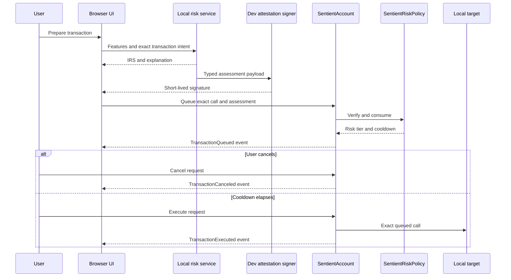

# Blockchain Design

## Scope and implementation truth

Sentient Wallet uses an **ERC-4337-inspired programmable risk policy** to demonstrate how an off-chain assessment could govern a local smart-account transaction. The current Solidity source is a focused development prototype, not a production wallet and not a claim of full ERC-4337 compatibility.

The prototype must run on a local development chain with development-only accounts. It must not require mainnet, testnet funds, a commercial RPC, or a production private key. Browser Demo Mode mirrors the lifecycle in application state and must label the chain, contract, and attestation as simulated.

Source files and tests do not by themselves prove successful deployment, security, integration, or test passage. Those claims require separate command output and end-to-end evidence.

## Design objectives

The local policy design aims to demonstrate five properties:

1. **Transaction binding:** a risk assessment cannot be reused for a different account, target, value, or call payload.
2. **Freshness:** expired assessments and stale policy versions are rejected.
3. **Replay resistance:** every account consumes sequential nonces and each digest can be used once.
4. **Proportionate friction:** configured score bands map to deterministic cooldowns.
5. **User cancellation:** the account owner can permanently cancel a queued action before execution.

The contracts do not determine whether the ML score is correct. They verify the identity and integrity of the signer and payload, then enforce configured rules.

## Components

### `SentientRiskPolicy`

The policy contract stores:

- an owner;
- a trusted development signer;
- moderate, high, and critical score thresholds;
- a cooldown for each non-low tier;
- a policy version;
- the next sequential nonce for each account; and
- consumed attestation digests.

It verifies an assessment, consumes it, classifies the 0-100 risk score, and returns the required cooldown. Changing the signer, thresholds, or cooldowns advances the policy version so previously signed assessments become stale.

### `SentientAccount`

The account prototype stores an owner and an immutable reference to the policy contract. The owner submits an exact call and a signed assessment. The account asks the policy to verify and consume the assessment, then records a queued transaction with:

- target, value, and call data;
- queue and eligibility timestamps;
- risk score and tier;
- cancellation and execution flags; and
- attestation digest.

Low-risk calls still enter the queue with a zero cooldown. This gives all requests a consistent audit path. Only the owner can queue, cancel, or execute.

### Development deployment

The local deployment script selects development accounts for policy ownership, assessment signing, and smart-account ownership. Its short cooldowns are demo configuration only. Addresses and keys created by the local node must never be reused or documented as production credentials.

## Attestation schema

The current EIP-712-style typed payload contains:

| Field | Purpose |
|---|---|
| `account` | Smart-account address authorized to consume the assessment |
| `target` | Exact call destination |
| `value` | Exact native-token value |
| `dataHash` | Keccak-256 hash of the exact call data |
| `riskScore` | Integer IRS from 0 through 100 |
| `nonce` | Expected sequential nonce for the account |
| `policyVersion` | Policy configuration version used when signing |
| `expiresAt` | Last valid block timestamp |

The EIP-712 domain binds the payload to the policy contract address, chain ID, name, and version. The current contract derives the risk tier from `riskScore`; it does not sign a separate `riskLevel`. It uses expiry but does not currently include a separate issued-at timestamp. Transaction identity is represented by the bound target, value, and data hash rather than a single opaque transaction hash.

These differences from the broader product brief must remain explicit. A later schema change requires coordinated signer, contract, browser/API, and test updates plus a version transition.

## Transaction lifecycle

The local risk service and signer in this sequence are integration targets. Their presence and connection must be verified before the sequence is presented as working end to end.

## Policy evaluation

The contract rejects scores outside 0-100 and requires strictly ordered thresholds. It classifies a score into Low, Moderate, High, or Critical. Low maps to zero delay; each higher tier maps to its configured cooldown.

The on-chain threshold is an enforcement configuration, not necessarily identical to the model’s evaluation threshold or browser risk-band boundaries. Full Local Mode must show the active contract policy and prevent hidden divergence between UI language and contract behavior.

When application rules overlap, the browser should use the maximum mandatory delay from model/policy threshold, frequency rule, and amount tier. The contract prototype currently enforces the cooldown derived from its own score bands. Adding other rules on chain is roadmap work unless implemented and tested.

## Trust boundaries

### Off-chain model

The model is trusted to calculate the signed score. The blockchain cannot observe whether the feature vector was complete, whether the model was appropriate, or whether an explanation was faithful.

### Attestation signer

The trusted signer is the principal oracle. A compromised signer can authorize a false low score for a dangerous call or create unnecessary cooldowns. Expiry, nonces, and call binding limit replay and substitution but do not correct a dishonest assessment.

### Policy owner

The policy owner can change signer, thresholds, and cooldowns. Those changes advance the policy version, but the role is still centralized. The UI must not describe policy as immutable or trustless.

### Account owner

The account owner controls queue, cancellation, and execution. A stolen owner key can authorize requests and execute eligible calls. The prototype has no social recovery, multisig, session-key, guardian, or hardware-wallet design.

### Browser and indexer

The browser may present optimistic state, but contract events are authoritative for local-chain queue, cancellation, and execution. Local storage is not secure evidence and must not determine whether an on-chain action happened.

### Local chain

Development time can be advanced and development accounts are publicly known. The local chain demonstrates state transitions only; it provides no production economic security.

## Privacy and data exposure

The attestation excludes the full model feature vector, explanation, wallet history, and discipline history. That is a useful minimization boundary, but it does not make the lifecycle private.

On a public chain, calldata and events can reveal or help derive the account, target, value, risk score, tier, nonce, timing, policy version, and eventual execution or cancellation. A hash of call data is a binding commitment, not an anonymity mechanism; the account also needs the original call data to execute. Repeated scores and interventions could become a behavioral profile.

The local prototype therefore must not be presented as privacy-preserving. A production exploration would need a separate disclosure and design review covering data necessity, public metadata, batching/linkability, private mempools, encrypted intent, selective disclosure, or zero-knowledge approaches. No such mechanism is claimed here.

## Contract and accounting invariants

1. An assessment is valid only for its exact smart account and exact call details.
2. A consumed digest cannot be used again.
3. A nonce must match the account’s next nonce and increments once on successful consumption.
4. A stale policy version or expired assessment cannot queue a transaction.
5. A cancelled request can never execute.
6. An executed request can never execute again.
7. A non-low request cannot execute before `executeAfter`.
8. Failed target execution must revert the execution-state update atomically.
9. Only the account owner can queue, cancel, execute, or transfer account ownership.
10. A contract event can create at most one corresponding application event.
11. Cancelling a transaction does not transfer funds to a Vault or create new capital.
12. Browser simulations must never be reconciled as local-chain confirmations.

## Threat model and current controls

| Threat | Current prototype control | Residual gap |
|---|---|---|
| Signature reused for another call | Account, target, value and data hash are signed | Upstream feature-to-call binding still depends on signer implementation |
| Replay of the same assessment | Consumed digest and sequential nonce | Cross-service nonce coordination must be reliable |
| Old assessment used after policy change | Policy version check | User must understand who changed policy and why |
| Expired assessment | Block-timestamp expiry | Timestamp manipulation and clock UX require bounds |
| Wrong signer | Recovered address must equal trusted signer | Trusted signer remains a central point of failure |
| Signature malleability | Prototype recovery helper rejects high-`s`, invalid `v`, and wrong length | Hand-maintained cryptography should be replaced with a widely audited library before any serious use |
| Early execution | `executeAfter` check | Cooldown policy may still be poorly chosen |
| Reentrant target | Account uses an execution guard and sets state before the call | Broader smart-account/plugin risks are not modeled |
| Owner misuse or compromise | Owner-only methods | No recovery, multisig, spend limit, or key rotation workflow |
| Malicious policy owner | Versioned policy changes and events | No timelock, multisig governance, or independent veto |

The brief prefers established cryptography libraries. The current minimal recovery library is acceptable only as reviewable local prototype source; replacing it with a maintained audited implementation is a hardening requirement.

## Events and application reconciliation

The policy emits ownership, signer, threshold, cooldown, policy-version, and attestation-consumption events. The account emits queued, cancelled, executed, and ownership events.

Full Local Mode should persist the transaction request ID and event transaction hash, then derive application status from confirmed events:

- `TransactionQueued` -> pending;
- `TransactionCanceled` -> terminal cancelled;
- `TransactionExecuted` -> terminal executed; and
- chain reset or reorganization -> reconciliation required.

The Vault and companion may react to a confirmed cancellation, but they must use the same immutable intervention ID so a page refresh or replay does not award progress twice.

## Required test evidence

The contract suite is intended to cover:

- threshold boundaries and score range;
- low-risk zero-delay execution;
- moderate, high, and critical cooldowns;
- execution before and after eligibility;
- permanent cancellation;
- malformed, wrong-signer, tampered, and expired signatures;
- exact target/value/data binding;
- replay and nonce rejection;
- stale policy versions;
- policy-owner authorization and version advancement;
- account-owner authorization;
- ownership transfer; and
- failed target calls and reentrancy behavior.

This list is a verification requirement, not a claim that the suite currently passes. Release documentation should record the exact command, environment, and result.

## Explicit non-goals and roadmap

The local prototype does not currently claim:

- ERC-4337 EntryPoint or UserOperation support;
- bundler, paymaster, aggregator, or session keys;
- audited upgradeability or module/plugin safety;
- production key management or remote signer hardening;
- mainnet/testnet deployment;
- real asset custody, swap, lending, or RWA integration;
- decentralized oracle consensus;
- privacy-preserving attestations;
- recovery, multisig, rate limits, or spending limits; or
- regulatory suitability.

Any move beyond local demonstration requires independent contract audit, threat modeling, dependency review, formal operational controls, and legal review before real funds are placed at risk.
